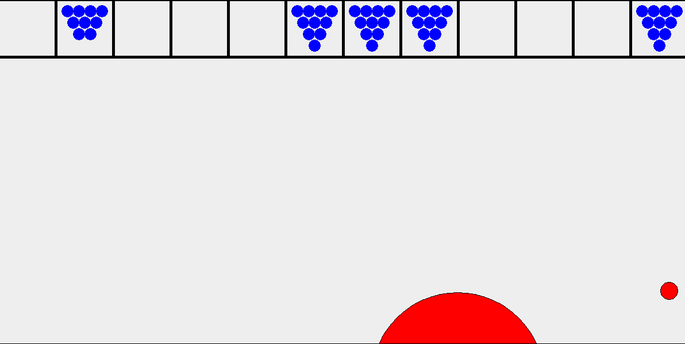

# Pongling (Pong-Bowling)

Pongling is a app idea I had that I wished to turn into an app. The idea is a mix of pong and bowling. You have a bowling ball at the bottom of the screen you control and a pong ball bounces off your ball, the sides and the frames. There are frames at the top (12 incase you get a strike on the tenth frame, you have a chance of getting two more shots). If you miss the ball and it reaches the bottom frame, you are penalized by getting a gutter on whichever frame you are on. All rules and scoring follow traditional bowling rules.

I got far enough in the java app that the pong ball will bounce of the walls, frames and bowling ball, but it needs a more realistic bounce. When it reaches the frames, it will knock the pins (in blue) over.

Future work for this project would be to keep track of score, add animation, work on the physics and implement as a iPhone/android application.

